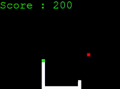
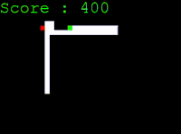
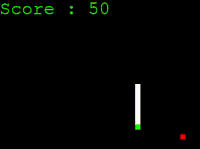
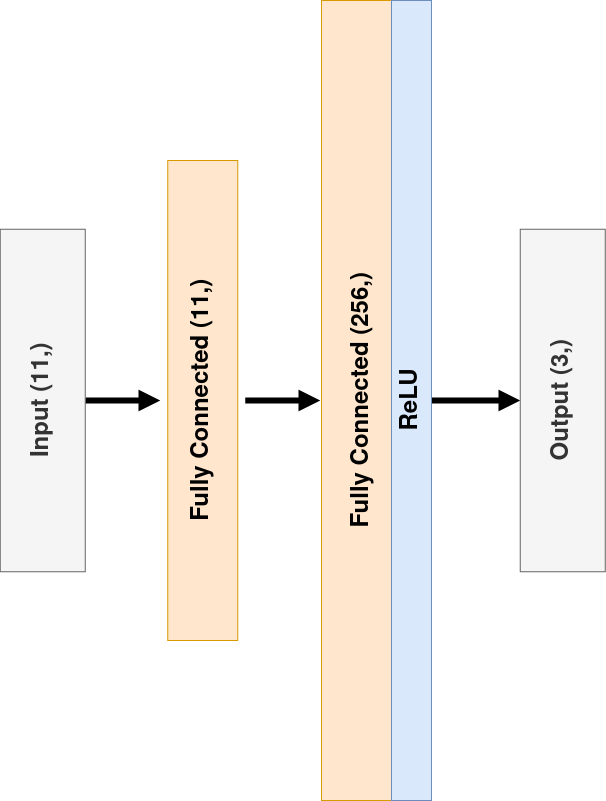

# Reinforcement learning with snake in pygame

## Background
### Reinforcement learning basics

#### _Agent_

#### _Environment_

#### _Action_

#### _Reward_

## Perception

The agent is able to _sniff_ food in 4 main directions - left,up,right,down.
Sniffing is based on position of the fruit obtained from the game environment and
projected as boolean list of directions.

## The Agent

## Training

### Neural net model

Used model is fully connected network built of two linear layers. 

### Deep Q-Learning (DQN)

## Testing

## Bibliography

_Coding_
- [GeeksForGeeks](https://www.geeksforgeeks.org/snake-game-in-python-using-pygame-module/) tutorial on creating snake game in Pygame from scratch
- [FreeCodeCamp.org](https://www.youtube.com/watch?v=L8ypSXwyBds) tutorial on turning snake into AI project

_Theory_
- [HuggingFace](https://huggingface.co/deep-rl-course/unit3/deep-q-network?fw=pt) guide on deep Q-Learning

## Further reading
- [Reinforcement Learning: An Introduction](http://incompleteideas.net/book/the-book.html)
- [Artificial Intelligence: Foundations of Computational Agents](http://www.cambridge.org/9781107195394)
- [Pytorch documentation](https://pytorch.org/docs/stable/index.html)
- [Pygame documentation](https://www.pygame.org/docs/)