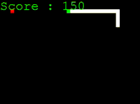
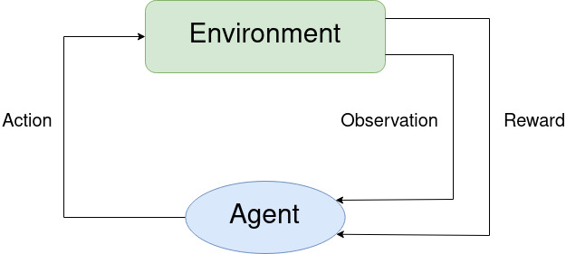
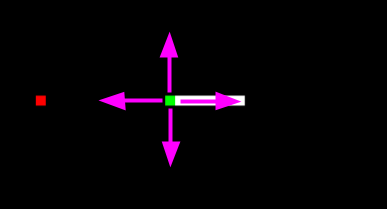
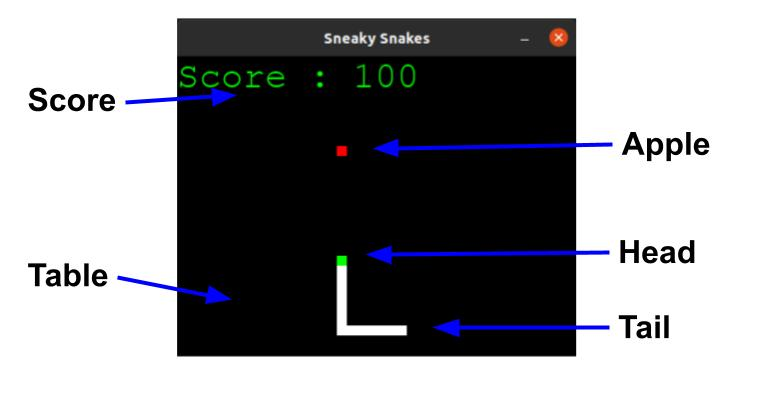
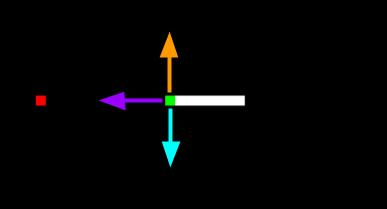

# Reinforcement learning with snake in pygame
[](https://opensource.org/licenses/MIT)
[](https://www.python.org/)
[](https://www.pygame.org/news)
[](https://pytorch.org/)
[](https://numpy.org/)
[](https://matplotlib.org/)




## RL building blocks



### Agent
The agent is an entity that can enforce actions on the environment 
and observe changes in it. According to the actions it takes, it is 
rewarded or punished in the process of training. It's learning itself
through trial and error and receives rewards as unique feedback. 
In our case the agent is replacing the human player in the process 
of controlling the snake.

Configurable parameters:
- _MAX_MEM_ - maximal number of sets of states stored for the training
- _BATCH_SIZE_ - size of single batch to train on
- _LR_ - learning rate

#### _Perception_

The agent is able to _sniff_ food in 4 main directions - left,up,right,down.
Sniffing is based on position of the fruit obtained from the game environment and
projected as boolean list of directions.



### Environment
The environment consists the table, the apple and the snake. 
They provide the information about current state and rewards for the actions
taken by the agent. In our case the environment is represented by following classes: 
`GameAI`, `SnakeAI`, `Fruit` and `Table`. The input for environment is agent's action 
and the outputs are observation and reward for the step or set of steps.

Configurable parameters:
- _SCREEN_WIDTH_ - table width
- _SCREEN_HEIGHT_ - table height
- _TICK_ - how fast should the snake move
- _SCALE_ - how wide the snake should be



### Action
The action is taken by the agent and is affecting the environment, 
more specifically the snake's next move. In our case action is represented as 
a list of 0's and 1's according to the following schema: `[straight, right, left]`.



Example:
- `[1,0,0]` means go straight wrt to the snake's head direction (choosing <span style="color:purple">purple</span> arrow)
- `[0,1,0]` means go straight wrt to the snake's head direction (choosing <span style="color:orange">orange</span> arrow)
- `[0,0,1]` means go straight wrt to the snake's head direction (choosing <span style="color:cyan">cyan</span> arrow)

### Reward
The reward is assigned based on the performance of the agent in the environment. 
The agent gets positive reward for getting the apple and negative for hitting walls/himself
or exceeding the time intended for exploration.


## Training

Create virtual environment in Python
```shell

```

### Neural net model

Used model is fully connected network built of two linear layers.<br>


### Deep Q-Learning (DQN)


## Testing

Run command:
```shell

```


## Bibliography

_Coding_
- [GeeksForGeeks](https://www.geeksforgeeks.org/snake-game-in-python-using-pygame-module/) tutorial on creating snake game in Pygame from scratch
- [FreeCodeCamp.org](https://www.youtube.com/watch?v=L8ypSXwyBds) tutorial on turning snake into AI project

_Theory_
- [HuggingFace](https://huggingface.co/deep-rl-course/unit3/deep-q-network?fw=pt) guide on deep Q-Learning

## Further reading
- [Reinforcement Learning: An Introduction](http://incompleteideas.net/book/the-book.html)
- [Artificial Intelligence: Foundations of Computational Agents](http://www.cambridge.org/9781107195394)
- [Pytorch documentation](https://pytorch.org/docs/stable/index.html)
- [Pygame documentation](https://www.pygame.org/docs/)